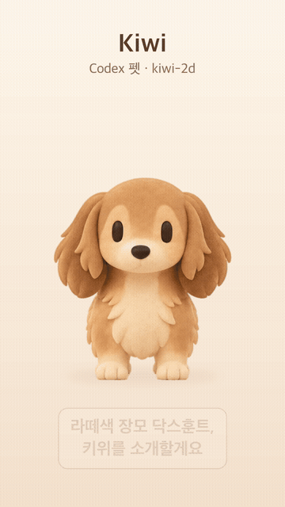

# Kiwi — Codex pet (`kiwi-2d`), Three.js 2.5D rig



Kiwi(키위)는 **라떼색 장모 닥스훈트**입니다. 원본 일러스트의 픽셀을 그대로 쓰고, 셰이더의 작은 역방향 변형(inverse warp)과
마스크 단위 이동으로 움직이는 **픽셀 기반 2.5D 리그**입니다. 3D 모델이 아닙니다.
이 저장소는 Codex 데스크톱 펫 v2 패키지(`dist/kiwi-2d/`)와, 그 패키지를 다시 만드는 소스 전체를 담고 있습니다.

## 바로 설치 / Quick install

Codex 데스크톱의 custom pet v2를 지원하는 버전이 필요합니다. / Requires a Codex desktop build that supports custom pet v2.

macOS / Linux 터미널에 붙여 넣으세요(이미 같은 폴더가 있으면 덮어쓰지 않고 멈춥니다). / Paste into a terminal (stops instead of overwriting an existing folder):

```sh
pet_dir="${CODEX_HOME:-$HOME/.codex}/pets/kiwi-2d"
[ -e "$pet_dir" ] && { echo "already exists: $pet_dir"; } || {
  mkdir -p "$pet_dir" &&
  base=https://raw.githubusercontent.com/juicos61-arch/kiwi-threejs-pet/main/dist/kiwi-2d &&
  curl -fsSL -o "$pet_dir/pet.json" "$base/pet.json" &&
  curl -fsSL -o "$pet_dir/spritesheet.webp" "$base/spritesheet.webp" &&
  echo "installed: $pet_dir"
}
```

또는 [Releases](https://github.com/juicos61-arch/kiwi-threejs-pet/releases)의 `kiwi-2d.zip`을 받아 `~/.codex/pets/kiwi-2d/`에 `pet.json`과 `spritesheet.webp`를 넣으세요.
Or download `kiwi-2d.zip` from Releases and put `pet.json` + `spritesheet.webp` into `~/.codex/pets/kiwi-2d/`.

그다음 Codex의 펫 선택 화면에서 **Kiwi**를 고르세요(선택 화면 구성은 Codex 버전에 따라 다를 수 있습니다). / Then pick **Kiwi** in Codex's pet picker (the picker may differ by Codex version).

## 펫 패키지

`dist/kiwi-2d/spritesheet.webp`(1536×2288, 192×208 셀, 무손실) + `pet.json`.
Codex 펫 폴더(예: `~/.codex/pets/kiwi-2d/`)에 두 파일을 복사하면 됩니다.

| 상태 | 프레임 | 표시 시간(ms) |
| --- | --- | --- |
| idle | 6 | 280·110·110·140·140·320 |
| running-right / running-left | 8 | 120×7·220 |
| waving | 4 | 140×3·280 |
| jumping | 5 | 140×4·280 |
| failed | 8 | 140×7·240 |
| waiting | 6 | 150×5·260 |
| running | 6 | 120×5·220 |
| review | 6 | 150×5·280 |
| look | 16방향(22.5° 간격) | — |

알아 둘 점(원본 그림의 한계를 그대로 따름):
- 정면에서는 꼬리가 보이지 않아 정면 상태에는 꼬리 움직임이 없습니다.
- 원본 측면 그림에서 앞다리 두 개·뒷다리 두 개가 겹쳐 있어, 달리기는 앞다리쌍/뒷다리쌍 단위로 교대합니다(가려진 다리 픽셀을 새로 만들지 않음).
- `running-right`는 `running-left` 셀을 좌우 반전한 것입니다.
- 눈 자리 인페인트(`plate`, `side_plate`)는 추정으로 채운 픽셀입니다.

## 실행·미리보기

요구 사항: Node.js(확인한 버전: v24.15.0), WebGL2 브라우저(확인: Chrome headless). Safari·다른 Node 버전은 확인하지 않았습니다.

```bash
npm ci            # three 0.180.0 한 개
npm start         # http://127.0.0.1:5173/  (포트 변경: PORT=5199 npm start)
```

- `http://127.0.0.1:5173/pet.html` — v2 펫 미리보기: 상태 선택, v2 표시 시간으로 재생, 실물 192×208 셀·3배 확대, 흰/검정/체커 배경, look 각도.
- `http://127.0.0.1:5173/` — v1 정면 대기(호흡·깜빡임) 프로토타입과 PNG 시퀀스 내보내기.

런타임은 CDN·외부 API를 쓰지 않습니다(`node_modules/three`를 importmap으로 로드). 서버는 127.0.0.1에만 열리며 `./export/`에만 씁니다.

## 스프라이트시트 다시 만들기

```bash
python3 -m venv .venv && .venv/bin/pip install -r requirements.txt   # numpy, opencv-python-headless, pillow
npm start
# pet.html을 연 브라우저 콘솔에서:
await pet.exportCodexAtlas()
```

1. 모든 atlas 프레임을 스테이지 해상도(768×832 PNG)로 렌더해 `export/codex-v2/stage/`에 저장합니다.
2. 로컬 서버가 `.venv/bin/python tools/build_codex.py`를 실행합니다: 4×4 프리멀티플라이드 박스 축소 → 192×208 셀 → `dist/kiwi-2d/spritesheet.webp` + `pet.json`, 보고서는 `export/codex-v2/`.
3. Codex `hatch-pet` 검증기(`validate_atlas.py`, `inspect_frames.py`)가 있으면 함께 실행합니다. 이 저장소에는 포함되지 않으며, `~/.codex/skills/hatch-pet/scripts` 또는 `HATCH_PET_SCRIPTS=/경로`에서 찾고, 없으면 `skipped`로 기록합니다.

콘솔 API: `pet.renderState(state, tMs)`, `pet.renderLook(deg)`, `pet.exportCodexAtlas({ build, only })`, `pet.atlasJobs()`.

## 에셋 재생성

```bash
.venv/bin/python tools/prepare_assets.py   # 정면: assets/derived/{front_crop,alpha_matte,base,plate,eyes,warp,layout.json}
.venv/bin/python tools/prepare_rig.py      # 정면 머리·귀·주둥이·다리 마스크
.venv/bin/python tools/prepare_side.py     # 측면 컷아웃, 눈 인페인트(추정), 다리쌍·꼬리·귀 마스크
.venv/bin/python tools/verify_frames.py <PNG 시퀀스 폴더>   # v1 시퀀스 수치 검사
```

## 파일 구조

```
pet.html, src/pet-main.js   v2 펫 미리보기·내보내기 UI
src/pet.js                  정면·측면 리그, 셰이더, 렌더러
src/poses.js                상태별 키 포즈, V2_ROWS(표시 시간), 16방향 look
index.html, src/main.js, src/kiwi.js, src/zip.js   v1 정면 대기 프로토타입
server.mjs                  127.0.0.1 정적 서버 + export/빌드 엔드포인트
tools/                      에셋 준비·atlas 빌드·검증 (Python)
assets/source/              원본 그림 1장 (kiwi_turnaround.webp, sha256 43d85f05…c165a8)
assets/derived/             원본에서 코드로 만든 레이어·마스크·레이아웃
dist/kiwi-2d/               Codex 펫 v2 패키지
docs/                       미리보기 GIF·썸네일
```

## 라이선스

- **코드**(`src/`, `tools/`, `server.mjs`, `*.html`, 설정 파일): [MIT](LICENSE), © 2026 juicos61-arch.
- 그림에 대한 예외는 [ARTWORK.md](ARTWORK.md)에도 적어 두었습니다.
- **그림**(`assets/source/kiwi_turnaround.webp`, `assets/derived/*`, `dist/kiwi-2d/spritesheet.webp`, `docs/*` 이미지): **MIT 적용 대상이 아닙니다.**
  저장소 소유자가 권리를 보유하며, 공개 재사용 조건은 아직 정해지지 않았습니다. 이 프로젝트를 실행·빌드하고 살펴보는 목적의 사용 외에는, 재배포·수정·상업적 이용 전에 소유자에게 문의해 주세요.

## 크레딧

- 캐릭터 그림: 소유자 제공 3면도 1장(`assets/source/kiwi_turnaround.webp`). 파생 에셋과 모든 애니메이션 프레임은 이 한 장에서 코드로 만들었습니다. 이미지 생성 AI로 만든 프레임은 쓰지 않았습니다.
- [three.js](https://github.com/mrdoob/three.js) 0.180.0 — MIT License (npm으로 설치, 저장소에 포함하지 않음)
- 개발 도구(런타임 미포함): [OpenCV](https://opencv.org/) opencv-python-headless (Apache-2.0), [NumPy](https://numpy.org/) (BSD-3-Clause), [Pillow](https://python-pillow.org/) (MIT-CMU)
